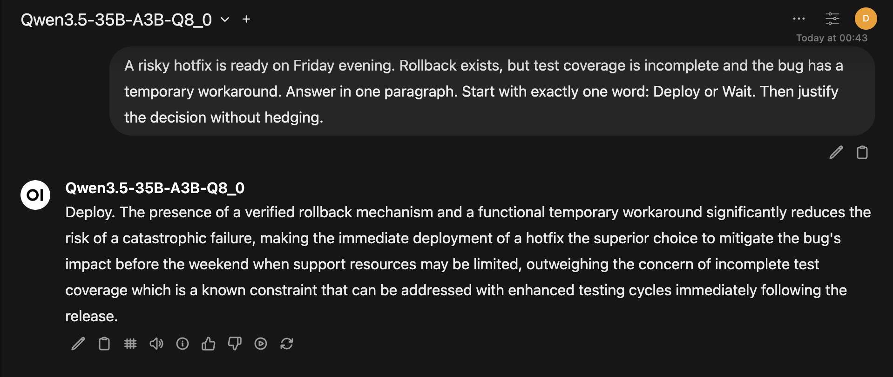
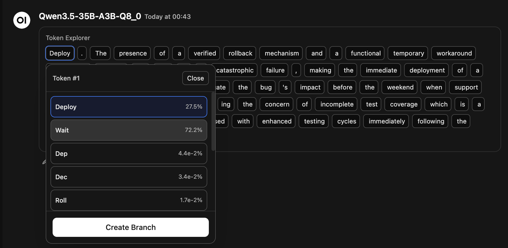
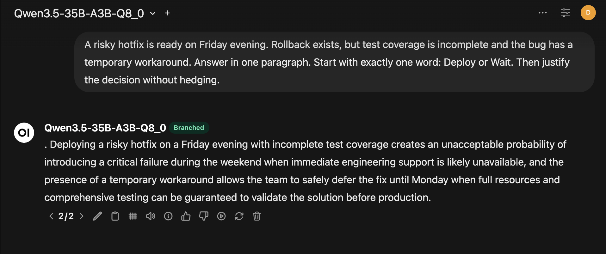

# Ariadne

Ariadne is a local-first LLM workbench for bounded long-chat continuity, exact recall, evidence-first retrieval, practical local voice, and inspectable generation.

Through its Open WebUI inheritance, Ariadne remains a full local AI workbench with chat, voice, files, tools, and the broader interaction surface people expect from a real daily driver.

It is for people already running local models, especially `llama.cpp`-style stacks, who care about prompt-budget hygiene, controllable behavior, and being able to inspect what the system actually did.

The thesis is simple: local LLM UX fails predictably when chat history is replayed naively, retrieval is allowed to sprawl, literature is flattened into generic ingest, and generation becomes an opaque black box. Ariadne is narrow on purpose. It exists to make one local workflow sharper, not to flatten every workflow into a generic chat surface.

Built on Open WebUI, Ariadne diverges where local-first power-user workflows need tighter control: long-running chats, context overflow, exact recovery of old facts, practical local TTS quality, deliberate literature handling, and generation inspection that is useful during real debugging rather than only during demos.

Ariadne started a while back as an Open WebUI fork, then diverged into its own local-first runtime with different priorities, constraints, and operating assumptions.

This README documents Ariadne as its own project, not as an annotated description of upstream behavior. If a lane, continuity model, corpus path, telemetry surface, or control surface is described here in detail, assume it belongs to Ariadne unless stated otherwise.

In practice, the local stack behind Ariadne is centered on `llama.cpp`, OpenAI-compatible local serving, and AMD Strix Halo hardware. A lot of the design decisions here are not abstract product ideas, but are tied to the behavior and limits of this real local runtime.

## Quick Navigation

- [Ariadne in One View](#ariadne-in-one-view)
- [Why Ariadne Exists](#why-ariadne-exists)
- [What Changed from Upstream](#what-changed-from-upstream)
- [What Was Actually Validated](#what-was-actually-validated)
- [Context and Memory in Ariadne](#context-and-memory-in-ariadne)
- [Web Search and Retrieval Planning](#web-search-and-retrieval-planning)
- [Optional Local Corpus Lane](#optional-local-corpus-lane)
- [Deep Research as a Separate Lane](#deep-research-as-a-separate-lane)
- [Voice / TTS](#voice--tts)
- [Token Exploration and Response Branching](#token-exploration-and-response-branching)
- [Thinking / Reasoning Controls](#thinking--reasoning-controls)
- [Recent Lessons](#recent-lessons)
- [Compatibility / Install](#compatibility--install)

Reading paths:

> **Architecture path**  
> [Ariadne in One View](#ariadne-in-one-view) -> [What Was Actually Validated](#what-was-actually-validated) -> [Context and Memory in Ariadne](#context-and-memory-in-ariadne) -> [Web Search and Retrieval Planning](#web-search-and-retrieval-planning) -> [Optional Local Corpus Lane](#optional-local-corpus-lane) -> [Deep Research as a Separate Lane](#deep-research-as-a-separate-lane)
>
> **Local corpus path**  
> [Ariadne in One View](#ariadne-in-one-view) -> [What Was Actually Validated](#what-was-actually-validated) -> [Optional Local Corpus Lane](#optional-local-corpus-lane) -> [Recent Lessons](#recent-lessons)
>
> **Local runtime UX path**  
> [Ariadne in One View](#ariadne-in-one-view) -> [Context and Memory in Ariadne](#context-and-memory-in-ariadne) -> [Voice / TTS](#voice--tts) -> [Token Exploration and Response Branching](#token-exploration-and-response-branching) -> [Thinking / Reasoning Controls](#thinking--reasoning-controls)

The priority set here is:

- local-first behavior
- long-chat survivability
- memory with evidence and recall, not summary-only compression
- fast-path UX by default, with bounded slow paths only when needed
- lightweight local voice that sounds good
- token-level inspection and deliberate response branching for real debugging and research
- honest control surfaces for `llama.cpp`-style local stacks

That is the frame for the rest of this document.

## Ariadne in One View

There are four deliberate lanes in Ariadne. Trying to force all of them through one vague "chat with tools" path is how local stacks become slow, opaque, and prompt-heavy.

```text
User request
    |
    +--> Chat lane     -> bounded hot context -> exact recall when needed -> token inspection when supported
    +--> Web retrieval -> plan -> target -> bound evidence -> stop
    +--> Local corpus  -> shortlist sources -> retrieve evidence inside them -> open tables/figures explicitly
    +--> Deep research -> sidecar job -> artifact output -> no report dump in chat context
```

### Chat lane

The normal fast path stays in the chat. It uses server-side context maintenance, a bounded hot working set, structured state snapshots, and exact recall only when evidence is needed. When the backend exposes the necessary telemetry, this lane also supports token-level inspection and deliberate response branching, so local generation is less of a black box.

### Web retrieval lane

This is the current-answer evidence path. It plans, targets, and bounds web retrieval for a chat turn, then stops once enough evidence exists. It is there for the single purpose of improving an answer, mostly (paradoxically, I know) by avoiding pouring web text into context without a care in the world.

### Local corpus lane

This is the on-disk evidence path for any proprietary, bought, or locally curated literature. It is domain-first on purpose: first narrow the source set, then retrieve evidence inside that narrowed set. The selector layer and the evidence layer are separate because "find the right source" and "extract the right evidence from that source" are not the same job. Think a librarian that looks for a passage in a book - they first approach Section, then Row, then Shelf, then Book, then Paragraph. I do the same, only with proper corpus curation and rigid model harness.

### Deep research lane

This is a separate blocking backend path for report generation through a sidecar. It returns artifacts and sources, not a giant report dump in model context. That makes it slower than the chat and retrieval lanes by design, but also more honest about what the system is doing.

## Why Ariadne Exists

Ariadne is narrow on purpose.

The main idea is that local LLM UX falls apart in a few predictable places:

- context windows fill up long before the conversation is actually "done"
- automated model-created summary alone is not proper memory
- retrieval lanes get collapsed into one vague "use tools and cross your fingers"
- local literature (PDF books, for example) gets flattened into a generic blob that destroys source boundaries
- local TTS often sounds either too synthetic or is too heavyweight
- token-level generation is usually hidden, even when you need to inspect or steer it

So Ariadne biases toward:

- server-side context hygiene
- bounded recall
- planned and bounded evidence gathering
- domain-first literature handling instead of flattening and RAG wizardries
- lightweight but good local TTS
- generation observability and deliberate branching

The point is a sharper local workflow with clearer operational contracts.

## What Changed from Upstream

The important divergences are at this point far from cosmetic. They fall into a few deliberate clusters.

The labels in this section belong to Ariadne's runtime model, not generic Open WebUI (the giant on whose shoulders Ariadne sits) vocabulary. Here, context maintenance, exact recall, and ledger continuity are treated as explicit backend-owned runtime layers with their own lifecycle and telemetry, rather than being left implicit inside a more general chat path.

### Continuity Model at a Glance

At request time, the continuity path in Ariadne is now more like this:

```text
persisted branch history
    -> reconstruct request history
    -> build bounded hot context
    -> compact older turns into a structured state snapshot when needed
    -> if the hot context still lacks evidence, query older turns through SQLite FTS5/BM25 or a bounded recent-branch scan
    -> inject a ledger note only if the selected mode and current turn make it relevant
    -> send the final prompt to the model
```

The key concepts are:

- `hot context`: the bounded working set for the current turn, built against the live prompt budget of the active runtime
- `structured state snapshot`: the durable earlier-turn state that replaces older raw turns during compaction
- `exact recall`: the bounded evidence-recovery layer used when older raw facts are needed again, closer to a server-side "find in earlier conversation" path than to always-on RAG
- `ledger`: a separate Ariadne continuity layer for durable task-state or style guidance, with explicit `vibe` and `agentic` modes

**Memory and Context**

- A backend-owned context-maintenance layer builds a bounded hot context for each turn instead of replaying the whole branch until it fails.
- Earlier history is compacted into a structured state snapshot that preserves durable task state without pretending to be raw evidence.
- A separate exact-recall layer can recover older raw facts when the hot context is no longer enough, using SQLite `FTS5`/`bm25(...)` over persisted branch history when lexical search is viable and bounded raw branch scans when it is not.
- Ledger continuity is an explicit, chat-scoped continuity layer that captures durable task state or conversational style and reinjects it only when the selected mode and current turn make it relevant.

**Retrieval Discipline**

- Web retrieval is planned, strong-source aware, and bounded.
- Request-scoped memory and tool telemetry make continuity and tool-path failures inspectable without permanent log bloat.
- The inherited `Task Model` surface is now treated internally as a narrow transitional `bounded specialist` slot for allowlisted transforms rather than as a second general chat brain.
- Local-corpus routing discipline now exists in both `native` and `default` tool-calling paths.

**Specialized Evidence Lanes**

- A domain-first local corpus lane exists for proprietary or bought literature instead of flattening everything into one generic knowledge pile.
- Deep research is a separate blocking lane through a Local Deep Research (`LDR`) sidecar.

**Runtime Surfaces**

- Kokoro adds a practical local TTS path. Despite being "old" by today's standards, I believe it still remains one of the richest and lightest text-to-speech options.
- Token explorer support and manual response branching make compatible local generation less of a black box. It is worth mentioning that the current `llama.cpp` does not surface that telemetry for streamed native/tool-call responses - rely on function_calling=default whenever required.

### Transitional Bounded Specialist Slot (V1)

The old public `Task Model` settings now carry a narrower internal meaning in Ariadne than they used to.

For V1, Ariadne keeps the upstream-style `TASK_MODEL` / `TASK_MODEL_EXTERNAL` config surface intact, but treats it internally as one bounded specialist slot. The point is pragmatic: get the latency and cost win for stable transformation work without pretending a second full router/specialist registry already exists.

That bounded slot is allowlisted and deliberately narrow. It can be used for things like:

- title generation
- tags generation
- follow-up generation
- autocomplete
- query generation
- context-maintenance summary work
- function-calling helper selection
- web planner query rewriting and planner-side query generation when explicitly enabled

It is not used for the final user-facing answer path. The active chat model remains responsible for normal answer synthesis, broad reasoning, and ambiguity-heavy turns.

Routing in this V1 is deterministic rather than model-routed:

- only explicit task kinds may use the bounded specialist slot
- the slot is resolved from the existing local/external `Task Model` settings
- if no bounded specialist is configured, behavior falls back cleanly to the active model
- if specialist execution fails, returns invalid output, or cannot satisfy the contract, Ariadne escalates back to the active model

This is an intentionally transitional abstraction. The code marks it as such so later migration to a real router/specialist registry can stay mechanical instead of philosophical.

The rest of this README explains the rationale and constraints behind those choices.

## What Was Actually Validated

This README makes narrow claims on purpose.

It does not claim that local RAG is solved, that models obey tools reliably by default, or that one runtime can erase backend differences. What was validated in practice is narrower and more honest:

- the lane split is useful on a real local OWUI instance
- bounded hot context plus exact recall keeps incredibly long chats usable without pretending memory is free (in 2026 it is anything but)
- focused search can gather bounded evidence without turning into a prompt-dumping ritual and hoping that the model "will figure it out"
- a domain-first local corpus architecture works better for all the cases where response quality is sought instead of vibes (e.g. in medicine, offensive security, legal compliance, etc.)
- table-aware retrieval and page/section-grounded answers are viable without flattening a literature shelf
- token-level inspection and manual branching are practical on compatible local runtimes

The main validation corpus was medical literature. It was an engineering choice joined to a real need: a domain with near-zero tolerance for citation sloppiness, bad ingest, and casual reasoning drift. If the system is going to flatten distinctions, misroute retrieval, or bluff its grounding, medicine was a fast place to find out.

Architecture problems are expensive. Ranking problems, tool obedience, and query hygiene are irritating, but fixable. Ariadne is aimed at getting the expensive mistakes out of the way first.

## Context and Memory in Ariadne

This section is about keeping long chats usable on local runtimes. It is not a license to replay everything until the model breaks, and it is not an excuse to run retrieval on every turn. My self-imposed job was to ship a system that maintains a bounded working set, recovers older facts when needed, and keeps that behavior inspectable.

The terms in this section belong to Ariadne's runtime model. They describe layers implemented in this repo, not generic Open WebUI concepts.

- `hot context`: the bounded request-time working set assembled by backend context maintenance against a live prompt cap derived from the active runtime
- `structured state snapshot`: the canonical summary block produced during compaction and merged into the system message as durable earlier-turn state
- `exact recall`: a bounded evidence-recovery step that runs only when the current turn appears to need older raw facts, currently through SQLite `FTS5` with `bm25(...)` ranking over persisted earlier turns
- `ledger`: a separate Ariadne memory layer for durable task-state or style continuity, with explicit `vibe` (for more regular every-day chats) and `agentic` (when precision matters more) modes

At request time, the memory path is now more like this:

```text
persisted branch history
    -> reconstruct request history the way OWUI actually sends it
    -> build bounded working memory (system + anchor + snapshot + recent tail)
    -> if evidence still looks weak, run exact recall (SQLite FTS5/BM25 or branch_recent)
    -> if continuity mode requires it, inject a ledger note
    -> send the final prompt to the model
```

### Stage 1: Context Compaction

The first change was server-side context maintenance.

Instead of replaying the entire branch forever, the server keeps:

- the system prompt
- a smart anchor from the start of the chat
- a recent raw tail of messages
- a rolling summary for the older middle

This context maintenance happens inline when the request would overflow, and in the background after a turn when the history is approaching the configured budget.

The goal was straightforward: do not wait for the backend runner to guess what to trim semantically, and do not bluntly drop the oldest turns if the opening contract of the chat still matters.

That compaction layer has since been tightened into a more explicit `hot context` model. Instead of treating the prompt budget as a vague maximum, Ariadne now derives a live prompt cap from the active `llama.cpp` runtime and budgets working memory against that real ceiling.

### Stage 2: Structured State Snapshot

The second change was a better recap format.

Instead of asking the model for a narrative summary, Ariadne asks for a structured state snapshot with sections such as:

- User Objectives
- Constraints and Preferences
- Decisions and Conclusions
- Open Questions and Unresolved Work
- Stable Facts and Assumptions

That change matters because models generally behave better when earlier conversation state is presented as explicit structure rather than a prose recap. It reduces drift and makes selective attention less fragile.

It is also worth being explicit about how that snapshot is produced. The snapshot is built from the older middle of the conversation, not from the whole chat indiscriminately: the server keeps the system prompt, preserves an early anchor, preserves a recent raw tail, flattens the older slice between them, and asks the task model to rewrite that slice into exactly five canonical sections. The result is then normalized back into the same canonical shape before it is stored and injected, so the runtime is not depending on a free-form recap style staying stable across turns.

That implementation is also designed to avoid "recap of a recap of a recap". The fork persists both the snapshot text and the exact raw message boundary it summarizes through, then reuses that stored snapshot directly while later turns stay in the raw tail. Refresh is triggered only when enough new raw growth has accumulated beyond that boundary, and the new snapshot is generated from raw history up to the new boundary, not by summarizing the previous snapshot text again.

There is a deliberate contract behind that. The snapshot is for durable state only, not for transient literals, one-off canaries, or recoverable raw evidence. If a literal detail should survive only as evidence from raw history, it should be excluded from the snapshot and recovered later through exact recall.

### Stage 3: Exact Recall

The third change adds a real recall layer on top of working memory.

Working memory still looks like this:

- system prompt
- anchor
- structured snapshot
- recent raw tail

But if that live state does not provide enough evidence, the server can now recover older raw facts from earlier turns and inject them back into the prompt as evidence.

The method matters here. On the current SQLite-backed path, this is not a vague "memory search" claim. Ariadne maintains a lexical index over earlier chat messages and uses SQLite `FTS5` with `bm25(...)` ranking to recover bounded candidates from persisted branch history. Conceptually, it is closer to a server-side version of what a careful user could do with browser Find over an earlier conversation, except the backend can do it against older turns that are no longer in the live prompt window.

This recall layer is intentionally bounded and conservative. It is not an always-on retrieval ritual before every response.

It currently has two modes:

- `FTS recall`
  Used for explicit references, missing entities, and continuation cases where there is a useful lexical query. This is the preferred path: query the SQLite `FTS5` index, rank candidates with `bm25`, recurse into narrower lexical subqueries when needed, and inject only a few bounded evidence snippets.

- `branch_recent recall`
  Used for vague referential phrases like "the other tool" or "the old config", where sending pronoun-heavy text into FTS would likely fail. Instead of pretending those are good search queries, the fork inspects a bounded recent branch window and recovers a few likely disambiguating turns.

There is also an important operational distinction now:

- `FTS` is the preferred evidence path
- but it is no longer a single point of failure

If explicit/entity recall fires and lexical retrieval does not produce usable evidence, the system now falls back to a bounded raw branch scan instead of silently collapsing into a weak generic answer. That is a deliberate maturity step: retrieval is no longer "try FTS and hope". It is now "prefer indexed recall, but still recover raw evidence when the lexical path misses".

Recovered snippets are injected as evidence, not as narrative:

```text
Evidence from earlier conversation:
[turn <id> | <role>]
...
```

That provenance matters. The model is being shown evidence, not a second-hand retelling.

One subtle but important detail here is that the recall path now follows the original OWUI request lifecycle more closely. In the normal frontend flow, the newest user turn may exist in the in-flight request before it has been persisted back into chat history. Ariadne reconstructs request history accordingly: if the current user turn is not yet in the database, it loads persisted history up to its parent and appends the current in-flight user turn before running maintenance and recall. That keeps the cold-history path aligned with how the product actually behaves, not just how a simplified synthetic pipeline would behave.

### Simulated User Flows

Here is what that means in practice.

**Flow 1: No recall needed**

- `User`: `Continue with ffuf for the next step.`
- `Trigger`: no recall; `ffuf` is still present in hot context.
- `Action`: the server does nothing special and the request stays on the fast path.

**Flow 2: Explicit factual recall**

- `User`: `What did we decide earlier about ffuf?`
- `Trigger`: bounded `FTS recall`.
- `Action`: the server queries the persisted chat index, pulls a few `bm25`-ranked matches for `ffuf`, injects the relevant excerpt as evidence, and only then lets the model answer.

**Flow 3: Missing entity, but no explicit "remember" wording**

- `User`: `Keep the same endpoint, but change the timeout to 5 seconds.`
- `Trigger`: the entity needed for continuation has fallen out of the live window.
- `Action`: the server runs lexical recall over older turns, recovers the earlier raw endpoint mention, and avoids making the model guess from the recap alone.

**Flow 4: Vague referential phrase**

- `User`: `What happened with that other tool?`
- `Trigger`: vague reference with poor lexical retrieval terms.
- `Action`: `branch_recent` inspects a bounded recent window of older branch messages and injects a few evidence snippets for disambiguation instead of forcing a bad FTS query.

The design bias is intentional:

- prefer false negatives over false positives
- do not tax every turn with retrieval
- recover old facts when evidence is weak, not whenever retrieval is merely possible

That same bias also explains the current fallback semantics:

- `FTS` should win when it is ready and precise
- `branch_recent` should help when the user is vague
- raw branch fallback should save explicit recall cases when indexing or lexical matching is not enough

The result is a layered memory system that is much less likely to fail silently. This is not even close to a "perfect memory", but it's a good start still.

### Runtime Semantics and Memory Telemetry

Ariadne also exposes the context system in its own runtime terms instead of hiding it behind a pile of internal budget math.

On each turn, the server can reason explicitly about:

- `live_prompt_cap`
- `hot_context_target_tokens`
- anchor size
- snapshot size
- recent tail size
- recall trigger reason
- recall mode
- evidence token cost
- whether fallback retrieval was used

When needed, that telemetry can be requested per turn with a debug flag and returned in the response as `memoryTelemetry`.

That design matters for a local-first system. Without it, the architecture may be doing the right thing but still remain opaque when something goes wrong. With it, Ariadne becomes inspectable in its own terms:

- was working memory too large?
- did snapshotting happen?
- did recall trigger?
- was lexical retrieval ready?
- did the system fall back to raw branch evidence?

This debug path is intentionally request-scoped. It is meant to help diagnose a specific turn, not to leave verbose memory logging enabled all the time and quietly fill production disks with telemetry.

There is now a second, operator-facing path for this data as well. Admins can enable an in-memory runtime telemetry tap from `Admin -> Telemetry` (or `Admin -> Analytics -> Runtime Telemetry`) and inspect recent tool-journey, prompt, memory, and model-activity events without opening browser devtools or persisting verbose traces into chat history by default. The tap is explicitly transient:

- it lives in a bounded in-memory ring buffer
- it can be started, stopped, and cleared independently of user requests
- it exists to inspect live routing and execution behavior, not to become another permanent log sink

The `/admin/telemetry` dashboard is intentionally small and operational rather than decorative. It gives you:

- `Start`, `Stop`, `Clear`, and `Refresh` controls for the in-memory tap
- high-level counters for total events, model-activity events, fallback count, and per-kind totals
- a recent-messages table showing which chats/messages accumulated activity, which models were involved, and which task kinds ran
- a recent-events table showing per-event timing, route metadata, model selection path, and fallback reason

That makes it practical to answer questions like "did the bounded specialist actually handle this planner rewrite?", "which model recovered after fallback?", and "where is the latency going?" without having to inspect browser console output by hand.

There is now a separate runtime control surface as well:

- `Admin -> Runtime`

That page is intentionally separate from telemetry. `/admin/runtime` is for operating the local `llama.cpp` launcher; `/admin/telemetry` is for observing what the running system actually did. The runtime page exposes a small allowlisted control plane over the local launcher script rather than a generic shell executor:

- current runtime state, profile, PID, port, resolved context/batch parameters, and script path
- explicit `dual` and `beast` launcher profiles
- `Start`, `Restart`, `Stop`, and `Refresh` controls
- bounded recent launcher logs
- read-only compatibility warnings when OWUI's bounded-specialist / planner settings do not match the current runtime profile

Those runtime compatibility checks are deliberately advisory rather than mutating. Ariadne does not auto-rewrite task-model or planner settings when the runtime topology changes; instead it surfaces split-brain risk explicitly so the operator can decide what to change.

At the launcher level, `scripts/run_llama.sh` now has a more stable machine-facing contract as well:

- `status --json` always returns JSON, even for stale PID or other broken-state cases
- `profile dual` / `profile beast` start named profiles without silently switching a running runtime
- `restart-profile dual` / `restart-profile beast` are the explicit switch path
- `logs --lines N` returns a bounded recent-log slice for UI/API use

For Ariadne's current local setup, the intended profile semantics are:

- `dual`: router mode, `MODELS_MAX=2`, `parallel=1`, `CTX=131072`
- `beast`: router mode, `MODELS_MAX=1`, `parallel=1`

For machine-local inspection without the browser, there is also a small helper script:

- `scripts/watch_runtime_telemetry.sh`

It speaks to the same admin analytics API used by the UI and can `start`, `stop`, `clear`, or continuously `watch` the live snapshot.

### Tool Journey Telemetry (On-Demand)

The same request-scoped discipline now exists for tool execution itself.

When a request is sent with `params.debug_tool_journey=true`, middleware records a bounded per-request tool trace and exposes it as `toolJourneyTelemetry` in the final response/message payload.

That trace captures concrete lifecycle facts such as:

- tool start and completion
- malformed argument parse failures
- per-call duration
- compact result summaries

When bounded-specialist routing is active, the same debug surface also records explicit `model_activity` events. Those events make it visible which model actually did the work for bounded subtasks and what role it played:

- `task_kind` and `operation`
- the active chat model versus the actual model invoked
- whether the actor was the bounded specialist or the active model
- selection path (`task_model`, `task_model_external`, or direct active-model use)
- fallback usage
- per-step duration
- error class on failure

That matters because "planner ran" is not the same thing as "which model rewrote the query, which one recovered after failure, and how long each step took".

For strong-source retrieval specifically, the summary includes useful decision signals such as local-phase execution status, Brave fallback usage, fallback reason, and quality/coverage indicators.

This is also emitted in real time as `chat:tool:journey` events, so an in-progress run can be inspected live.

It is off by default, capped, and explicitly opt-in per request.

### Ledger Continuity Modes

Ariadne treats ledger mode as an explicit memory control instead of a backend heuristic.

The ledger is not "memory" in the same sense as the structured state snapshot.

- the snapshot is the compacted working-state representation of earlier turns
- the ledger is a separate durable continuity layer backed by extraction and injection rules

In code, the ledger captures different kinds of durable material depending on the selected mode.

- `vibe` mode is for conversational continuity: tone profile and repeated refrains that should survive compaction without becoming a generic style heuristic
- `agentic` mode is for operational continuity: tooling choices, action mode, confirmation policy, evidence policy, side-effect policy, output contract, and durable decisions

The behavior is:

- `vibe` is the default mode for every chat
- `agentic` is enabled only through a chat-scoped toggle in the composer UI
- mode is persisted in chat params, so it survives reloads and continued sessions
- backend mode selection is driven by that explicit state, not by inferring "agentic-looking" language from recent turns

That tradeoff is intentional. It removes hidden mode flips and makes ledger behavior easier to reason about and debug.

Mode switching is also explicit and forward-only:

- existing chat history is left unchanged
- existing ledger entries are not auto-retired
- from the next turn onward, only the selected ledger kind is eligible for capture and injection

On the first turn after a mode switch, the selected mode can force a single ledger injection when active entries already exist for that mode. After that turn, normal selective gating resumes.

### Legacy Simon Pipe Cleanup

The old `simon-cognitive-engine` pipe stack is no longer part of Ariadne's supported runtime path.

That pipe mattered historically. `Simon` was the first standalone inference layer behind a frontend and backend in this ecosystem: voice-first (but not voice-only), with bounded memory, explicit recall, lexical search, and a deliberate split between fast answers and slower evidence-heavy paths. A lot of the design pressure that shaped Ariadne was first worked through there.

The reason to remove the pipe anyway was architectural. Keeping Simon as a live embedded runtime would have meant carrying Simon-specific plumbing, valves, and deployment assumptions everywhere Ariadne runs. The decision here was to keep the ideas, but re-implement the important runtime behavior natively in the OWUI request path.

What got rewritten into OWUI-native behavior instead of staying in the old Simon pipe stack:

- bounded working-memory construction and overflow-aware compaction in `context_maintenance.py`
- structured state snapshots with persisted summary boundaries instead of free-form recap loops
- exact recall and evidence injection in `chat_recall.py`
- explicit continuity capture/injection in `ledger.py`
- request-scoped memory telemetry and chat-lifecycle integration in middleware

What did _not_ stay as a separate Simon runtime:

- the old pipe model and valve surface
- the standalone Simon engine/gatekeeper/context-builder/persistence/retrieval orchestration layer
- the Simon install/dashboard scripts and DB-backed pipe/model override path

A few low-level helpers still carry the Simon name because they were useful to keep as local primitives rather than re-import from another project:

- lexical chat indexing and queue management in `simon_lex_index.py`
- lightweight memory-intent detection in `extensions/simon_engine/memory_intents.py`
- cheap token-budget estimation in `extensions/simon_engine/token_budget.py`

If an environment previously installed that pipe as a DB-backed function/model override, purge those records after deploy:

```bash
python3 scripts/purge_simon_cognitive_engine.py
python3 scripts/purge_simon_cognitive_engine.py --apply
```

The first command is a dry run. The second command deletes both legacy records:

- function id: `simon-cognitive-engine`
- model id: `simon-cognitive-engine`

After `--apply`, restart backend workers to guarantee no stale DB-loaded function modules remain in memory.

## Web Search and Retrieval Planning

This section is about the search path for normal chat turns. It is not a report generator, and it is not a license to pour raw web text into context. The job is to fetch enough evidence, from the right places, and stop.

In practice, this means the web path here is more structured than a simple flat search integration:

- multiple planner modes exist instead of one hardcoded query flow
- a source registry provides machine-readable hints about where different kinds of queries should go
- the planner can either use the active model directly or use the bounded specialist slot first for query rewriting / planner-side query generation, with explicit fallback back to the active model
- planner telemetry tracks retries, fallback usage, executed queries, and stopping conditions instead of treating the whole thing as opaque middleware

The important behavioral shift is this:

- upstream-style web search is often thought of as "query provider -> collect results -> inject results"
- Ariadne pushes it toward "plan -> target pre-curated trusted sources per domain (medicine, law, science, etc.) -> bound evidence -> stop when enough evidence exists"

That matters more on local setups than it first appears. Prompt budget is finite, retrieval latency is visible, and low-quality web evidence is actively harmful when it crowds out the rest of the conversation. The planner/rewriter/source-registry work is there to make web retrieval less brute-force and less noisy.

At a high level, the current web path behaves more like this:

1. choose a planning mode
2. optionally rewrite or refine the search queries using the active model
3. target sources with planner hints instead of treating all sources as equivalent
4. stop once the evidence quality or coverage is good enough, instead of continuing mechanically
5. surface planner status and fallback information so the path is inspectable

The planner-side specialist behavior is intentionally opt-in. Admins can keep the old behavior or explicitly enable bounded-specialist planner routing while still using the existing task-model slots:

- `Admin Settings -> Interface -> Task Model (Bounded Specialist)` chooses the small local/external specialist model
- `Admin Settings -> Web Search -> Use Task Model For Planner` lets the planner try that bounded specialist first

If enabled, the planner uses the bounded specialist slot for:

- query rewriting in `hybrid_rewriter` / `model_only`
- planner-side query generation when the planner falls back to generated search phrases

If the specialist path fails, planner execution does not stall or go opaque. It falls back to the active model and records that fallback in planner status payloads and on-demand tool-journey telemetry.

### Strong-Source Search Trigger (Hybrid Local-First + Broader Fallback)

The web stack includes a first-class native tool for evidence-critical retrieval: `web_research_strong` (`search_strong_sources` remains as a backward-compatible alias). There is a story behind this name: a quantized model attending in a quantized KV cache began insisting that the `search_notes_strong` tool is the one that it needs to use for web searches, which was neither injected, nor implied. It took me a while to realize it was hallucinating a tool name based on token similarity between the name itself and the one of another tool - `notes_lookup`. Stochastic engineering at its finest.

This is intentionally not a hard terminal guard. It is a native model-callable path with soft trigger semantics: when confidence is weak, the question is time-sensitive, or provenance quality matters, the model can call the strong-source flow directly.

The tool now supports a stateful contract:

1. `mode=list_categories`
2. `mode=list_domains` (for selected categories)
3. `mode=search` (for selected domains)

`mode=search` remains backward-compatible for single-call usage. But when the model needs explicit routing support, the stateful path is available and bounded.

Domain selection is explicit and constrained:

- model picks `1..4` domains
- domains are validated against the registry-derived allowlist
- invalid/empty selections return a correction payload, and search is not executed

In short: focused search is now an inspectable interaction protocol, not a one-shot black box.

### Tool Naming Matters

Model-callable tool names are part of the behavioral interface, not just cosmetics.

In practice, shared generic prefixes encouraged tool-name blending during selection. A notes-only tool and a focused web-research tool were close enough in model space that the model could invent plausible but nonexistent hybrids and keep reaching for the wrong call path.

To reduce that drift, Ariadne moved toward clearer affordances:

- `search_notes` -> `notes_lookup` (`search_notes` kept as a backward-compatible alias)
- `search_strong_sources` -> `web_research_strong` (`search_strong_sources` kept as a backward-compatible alias)

Tool descriptions were hardened as well:

- `notes_lookup`: **PERSONAL NOTES ONLY**
- `web_research_strong`: **WEB SOURCES ONLY**

This significantly improves real-world tool selection behavior, especially in long agentic loops where a model can otherwise get stuck in a misleading callable pattern.

### Hybrid Routing: Coarse Gate + Model Disambiguation

Classifier bloat was avoided on purpose.

Ariadne keeps a lightweight coarse gate with obvious buckets:

- `software`, `medicine`, `legal`, `science`, `news`, `shopping`, `general`

Routing behavior is hybrid:

- high-confidence coarse route: skip category pass and jump directly to domain shortlist
- low-confidence / ambiguous route: model first selects category, then domains, then runs focused search

This preserves speed on easy queries and flexibility on hard queries, without drifting into endless keyword creep.

### Evidence Surface Honesty

`web_research_strong` output is now intentionally layered:

- `items` = candidate pool (exploratory)
- `evidence_items` = evidence used for quality/coverage decisions
- `citation_items` = public citation surface

Default citation policy is stricter:

- `trust >= 0.72`
- non-community only by default
- canonical URL dedupe

Middleware citation extraction for this tool now prefers `citation_items` and falls back to `items` only if needed.

Numeric score remains available for diagnostics, but is no longer a default public confidence ornament.

### Engine and Fallback Policy

Focused broader fallback is engine-agnostic and admin-driven:

- fallback uses configured `WEB_SEARCH_ENGINE` (not hardcoded Brave)
- if engine is Brave, fallback remains paced and query-capped for free-tier constraints
- existing `search_web` path remains backward-compatible
- discovery does not depend on sitemap/seed hygiene from legacy sites

### Focused Search UX Contract

When focused search runs, chat now surfaces explicit progress using the existing web-search status UI (same expandable result block style as regular web search):

- `Focused search: running targeted queries`
- visible targeted phrases (model-rewritten / planner-executed)
- visible targeted websites/domains
- visible layer counts: candidate pool, evidence used, citations shown

If local-first evidence is insufficient, chat explicitly shows escalation:

- `Focused search did not return enough evidence, trying broader search now`
- updated phrases/sites for the broader pass

When search ends, the final focused-search status event is emitted with `done=true`, so the progress shimmer stops and the phase is visibly closed. Planner score is shown only in explicit debug mode.

### Operational Caveat: `is_local` Is a Routing Primitive

`local-first` depends on `planner_hints.is_local=true` entries inside the source registry. If a selected category has no such entries, there are no local candidates for Phase A, so focused search naturally behaves fallback-heavy (fast escalation to broader/non-local search).

This is expected behavior, not a planner bug: the routing contract is "prefer local-marked domains when they exist".

### Strong Domains in Practice

Ariadne does not ship a local evidence corpus. It ships a locally maintained strong-source domain registry used for routing and query constraints.

Current examples (from the registry) include:

- `science_academic`: `pubmed.ncbi.nlm.nih.gov`, `ncbi.nlm.nih.gov`
- `medicine_health`: `who.int`, `cdc.gov`
- `software_apis_devops`: `docs.python.org`, `kubernetes.io`
- `legal_compliance`: `eur-lex.europa.eu`, `dv.parliament.bg`

Where this lives:

- static registry file: `backend/open_webui/retrieval/web/source_registry.json`
- admin API (read/update): `/api/v1/retrieval/web/search/planner/source-registry`

## Optional Local Corpus Lane

Ariadne also supports a separate local-corpus path for cases where the strongest evidence is not on the web at all, but on disk.

That matters for a very specific class of workflows:

- proprietary literature
- bought handbooks and textbooks
- internal review corpora
- local material that should not be flattened into a generic OWUI knowledge blob

The important design choice here is the same one that shows up elsewhere in Ariadne:

do not collapse unlike jobs into one vague retrieval step.

For a real literature corpus, there are at least two different jobs:

- shortlist which local sources are worth searching
- retrieve evidence inside those selected sources

Ariadne does not treat a local corpus as "just another text pile to ingest".

It supports a domain-first lane with a split architecture:

- a lightweight serving layer for source selection
- per-document compiled artifacts for actual evidence retrieval

There are now two local-corpus operating paths:

- `v1`: direct lookup, shortlist, book card narrowing, evidence retrieval, table follow-up
- `v2`: a bounded reasoning layer for abstract questions, with problem framing, axis planning, grouped evidence, and conservative sufficiency assessment

### The Corpus Was Built, Not Ingested

This lane was validated against medical literature, and that choice was deliberate. Medical literature is not forgiving test data. It is a domain where citation sloppiness, weak ingest, and careless reasoning are exposed quickly.

The corpus was not produced by dragging PDFs into a generic knowledge feature and hoping embeddings would sort it out. It was built as a retrieval substrate: dozens of hours of source curation and cleanup, plus dozens of GPU-hours across conversion and fallback passes, aimed at producing something a model could interrogate through tools without immediately losing source boundaries.

If a corpus is going to be used through tools, it should be shaped for tool use from the start. That is the frame for the rest of this section.

### Why This Exists

The immediate practical reason was medical literature. The broader architectural reason was stricter evidence handling.

If you take a shelf of guidelines, manuals, and textbooks and dump all of it into a generic flattened RAG collection, you lose exactly the distinctions that matter:

- which domain a source belongs to
- which discipline it belongs to
- whether it is a guideline, handbook, textbook, atlas, or reference
- where the relevant evidence actually lives
- whether the useful answer is in a nearby table rather than in a prose paragraph

So the local-corpus path here was built around a stricter idea:

first narrow the source set, then retrieve evidence inside that narrowed set.

That gives the model a better chance of behaving like a careful reader instead of a stochastic blender.

### What A Corpus Should Look Like

If you want to use this path in your own fork, the expected shape is simple and strict.

At the corpus root:

- `_serving/domains/index.md`
- `_serving/serving-catalog.jsonl`

Then, per domain:

- `_serving/domains/<domain>/index.md`
- `_serving/domains/<domain>/disciplines/*.md`
- `_serving/domains/<domain>/books/*.md`

Then, per document:

- `<slug>--<book_id>/selected/retrieval.md`
- `<slug>--<book_id>/selected/catalog.json`
- `<slug>--<book_id>/selected/figures.json`
- `<slug>--<book_id>/selected/tables/`

That split is the contract.

The `_serving` tree is the canonical model-facing selection layer.
The per-document `selected/` tree is the canonical evidence layer.

If you preserve that distinction, the router and tool chain stay useful even as the corpus grows across domains.

If you flatten everything into one undifferentiated collection, you are throwing away the main value of the design.

### How The Corpus Was Produced

The production path was engineered in layers rather than as one ingest job.

1. Build a deduped source shelf with an offline pass such as `dedupe_by_filename.py`, so duplicate PDFs do not quietly fork the corpus.
2. Route each source through a Docling-focused offline compiler such as `medical_corpus_router.py` instead of assuming one pass will fit every document: standard structured parsing, a faster large-document text-first path, OCR/table retune fallback, and optional VLM fallback when needed.
3. Accept or reject attempts by policy, not optimism. Per-document manifests record selected route, confidence grades, page counts, markdown/plain-text yield, table and figure counts, failure reasons, and selected artifacts.
4. Emit compiled per-document artifacts: retrieval markdown with page markers, raw audit markdown, structural catalogs, figure metadata, table sidecars, and machine-readable manifests.
5. Build a small canonical serving layer with a dedicated builder such as `build_markdown_serving_layer.py`: domain indexes, discipline shortlists, book cards, normalized catalog rows, manual overrides, review queues, and quarantined failures.

Those are offline build steps, not runtime conveniences. That split is what lets the model route lightly at decision time while still having deep evidence on demand.

### Why The Corpus Is Shaped for Tools

The model-facing contract is intentionally split:

- `_serving` is the canonical selection layer
- each document's `selected/retrieval.md`, `selected/catalog.json`, `selected/figures.json`, and `selected/tables/` form the canonical evidence layer

That split exists because `source shortlisting` and `evidence retrieval inside selected sources` are different operations.

- selection happens on compact domain and book-facing markdown instead of a flattened full-text dump
- retrieval returns page markers, section paths, and nearby table/figure pointers so the model can follow up precisely
- weak extraction can be suppressed instead of being silently treated as trustworthy evidence
- failed or suspect sources can be quarantined instead of contaminating the primary shelf
- the model can open a table or figure metadata explicitly when the answer is table-shaped or image-adjacent

Those are not random implementation details. They are the retrieval contract.

### Engineering Path

With that production path in place, the OWUI integration path was intentionally incremental.

1. Keep the literature outside OWUI's generic ingest path.
2. Put a tiny serving layer in front of the compiled artifacts.
3. Add a domain-first router instead of a medicine-only one, so future domains can be added without redesign.
4. Add native tools that preserve `domain`, `discipline`, `book_id`, `resource_type`, page metadata, and nearby tables/figures.
5. Use lexical-first retrieval with metadata-aware reranking instead of jumping straight to embedding-heavy complexity.
6. Validate the whole flow against a live OWUI instance with tool telemetry turned on.

That last step matters.

The point was not just to make the tools exist. The point was to prove that a single loaded model could actually:

- choose the right local domain
- narrow to the right books
- retrieve evidence from those books
- open a table when the evidence was table-shaped
- answer with book/page/section grounding instead of free-floating synthesis

### How The Local Corpus Path Behaves

At a high level, the local-corpus lane behaves like this:

1. user asks a question
2. OWUI routes to a local domain when that is appropriate, or asks for domain narrowing if the query is ambiguous
3. the model shortlists books from the serving layer
4. the model opens book cards only for the shortlisted books
5. retrieval searches only those selected books
6. results return page, section, and nearby table/figure pointers
7. the model can open a table explicitly when the answer depends on it

That means the serving layer is not the evidence base.

It is the selector that sits in front of the evidence base.

The evidence base is still the per-document compiled output.

In `v2`, the same split still holds. The model can frame a problem, plan axes, and collect grouped evidence, but the underlying contract remains source narrowing first and evidence extraction second.

### Native Tool Surface

The model-facing tool family is intentionally narrow and explicit:

**Discovery and routing**

- `local_corpus_list_domains`
- `local_corpus_list_disciplines`

**Framing and planning**

- `local_corpus_frame_problem`
- `local_corpus_plan_axes`
- `local_corpus_shortlist_books`
- `local_corpus_view_book_cards`

**Collection and evidence access**

- `local_corpus_collect_axis_evidence`
- `local_corpus_retrieve_evidence`
- `local_corpus_view_table`
- `local_corpus_view_figure_metadata`

**Assessment**

- `local_corpus_assess_evidence`

That tool split is not cosmetic.

It is there to stop the system from pretending that "find a likely book" and "quote the evidence inside that book" are the same operation.

`v1` leans more on shortlist/retrieve/view. `v2` leans more on frame/plan/collect/assess. The phases are still deliberate either way.

The important constraint is that `v2` is still bounded and inspectable.

- axis count is backend-capped
- axes are scaffolds, not claims of completeness
- the backend assessor is intentionally conservative and narrow
- packs exist at different maturity tiers and are not presented as equally battle-tested

### Configuration and Runtime Expectations

The local-corpus lane is optional and local-first.

The important toggles are:

- `ENABLE_LOCAL_CORPUS_TOOLS`
- `LOCAL_CORPUS_ROOT`

There is also a chat-scoped operating control:

- `local_corpus_mode = off | auto | prefer`

That control exists because users do not always want the same thing.

- `off`: answer from weights and other enabled lanes; do not inject local corpus tools
- `auto`: let routing decide, but in `default` function calling first perform one deterministic inspection of the currently usable local domains before abandoning the local lane
- `prefer`: bias toward local corpus when the question is compatible

By default, Ariadne will auto-enable the tool family when a compatible `literature_corpus/` directory exists at the repo root.

Derived lexical indexes are built as disposable local cache artifacts under `backend/data/local_corpus/`. The corpus itself remains the source of truth.

## Deep Research as a Separate Lane

This section is about the blocking report-generation lane built around [Local Deep Research](https://github.com/deshev-tds/local-deep-research) (`LDR`). It exists for work that should produce a research artifact, not for ordinary chat retrieval. That distinction matters because bounded evidence gathering for an answer and backend report generation are different jobs.

### Why It Is Separate

The main design decision is simple:

- focused/web search improves a normal answer
- deep research produces a report artifact

Those are not the same workflow, and trying to merge them usually leads to the worst of both:

- bloated prompt context
- weak report synthesis
- unclear UX about whether the system is "thinking", "searching", or just stuck

So Ariadne treats deep research as a deliberate blocking path for the current turn. That is slower by design, but it is honest about what the system is doing.

### Execution Contract

The contract for this lane is intentionally strict:

- OWUI backend is the only client that talks to the LDR sidecar
- frontend does not call the sidecar directly
- sidecar auth is handled through an admin-configured service account
- once deep mode is selected, the request is no longer allowed to silently fall through into the normal model-completion path
- final report bodies are not injected back into model context
- the user gets downloadable artifacts instead: markdown plus an exported report format such as PDF

That last point matters. Ariadne already spends a lot of effort on prompt-budget hygiene, so deep research is explicitly not allowed to solve one retrieval problem by creating a worse context-pollution problem.

In practical terms, deep mode now behaves more like this:

1. start the sidecar research job
2. surface visible progress states in chat
3. wait for a terminal sidecar result
4. fetch and register report artifacts in OWUI storage
5. only then commit the assistant success message

That ordering is deliberate. The assistant should not claim "reports attached" before the files are actually registered and linked.

### Provenance and User-Facing Result

The user-visible outcome is also intentionally different from the normal chat path.

Instead of asking the model to rewrite a large sidecar report into yet another long in-chat answer, the system does this:

- attach the generated report files to the assistant turn
- surface the visited source URLs as normal OWUI source cards
- keep the assistant text short and factual

So the turn result is "research completed, here are the artifacts and sources", not "here is a giant second-hand summary pasted back into the prompt".

### Cancel and Failure Semantics

Because deep mode is blocking, cancellation semantics matter more than they do in a normal short turn.

Ariadne treats cancel as a real backend concern:

- if the user cancels while the sidecar is still working, OWUI does a best-effort terminate call to the sidecar
- if the sidecar has already reached terminal completion and OWUI is only finalizing artifact registration, a late cancel is not allowed to rewrite a successful run into a fake canceled one
- if export fails after markdown is available, the markdown artifact can still be preserved instead of pretending the whole run never happened

That same discipline also extends to storage:

- raw sidecar artifacts are kept under per-chat OWUI artifact directories
- attached files are registered through OWUI's normal file pipeline
- raw per-chat deep-research directories are cleaned up when chats are deleted

## Voice / TTS

Ariadne adds Kokoro because local TTS quality matters, and a lot of local stacks are either too robotic or too heavy for the quality they provide.

Kokoro was added as a practical compromise:

- more natural sounding voices than many lightweight alternatives
- lightweight enough to remain useful in local deployments
- broad enough voice selection to make experimentation worthwhile

Ariadne supports Kokoro in the places where it is actually useful:

- backend/local Kokoro ONNX
- browser-side Kokoro.js where that path makes sense

The point is not to chase the largest TTS stack. The point is to improve voice quality per watt, latency, and setup complexity.

## Token Exploration and Response Branching

Most chat UIs hide generation internals completely. That is convenient until you need to inspect why a response happened, or you want to deliberately fork from a different token path.

Ariadne adds token explorer support so you can inspect token/logit alternatives when the backend exposes the necessary telemetry. In the author's local stack, that means `llama.cpp` speaking an OpenAI-compatible API and returning usable logprob/top-logprob style data.

The explorer itself is fully implemented in Ariadne. The constraint is not the UI path; the constraint is backend capability.

Current `llama.cpp` does not surface usable token telemetry for streamed native/tool-call responses, so Token Explorer is unavailable on that path. Upstream's tool-calling and streamed-tool-delta work makes the reason explicit: the server reparses partial model output into semantic `tool_calls` deltas instead of exposing a stable per-token stream there, and it explicitly rejects `logprobs` when `tools` and `stream` are enabled together. If you need to work with token telemetry and streaming responses, simply choose function_calling=default.

It also supports manually creating a new response branch from a selected token alternative instead of treating the sampled continuation as sacred.

That matters for local workflows because it gives you:

- a way to inspect why a continuation happened
- a way to compare plausible alternatives
- a way to fork a response branch deliberately without rewriting the whole prompt

A representative branching flow is worth showing because it captures what this feature is actually for in practice.

**Step 1. The sampled answer commits to one path**

In this example, the model is forced to start with `Deploy` or `Wait`. The sampled answer picks `Deploy` and then builds a full recommendation around that choice.



**Step 2. Token Explorer exposes the early decision point**

Opening Token Explorer on token `#1` shows that `Deploy` was not the only plausible continuation. In fact, `Wait` is the stronger visible alternative on that token, with the rest of the continuation still available for inspection.



**Step 3. A manual branch can produce a materially different answer**

Creating a branch from `Wait` does not just change one word. It flips the recommendation and produces a new continuation built around the alternative token path. That is the point of the feature: inspect a live decision point, branch deliberately, and compare meaningfully different continuations without rewriting the prompt or regenerating blindly.



This is not presented here as "full interpretability". It is a practical debugging and exploration tool for model behavior.

It is also intentionally not implemented as "keep the whole live generation tree resident forever". In Ariadne, manual branching is driven by bounded token telemetry and a fallback prefix-forcing strategy, which is far more practical on local hardware than pretending every backend will give you infinite branching state for free.

## Thinking / Reasoning Controls

Open WebUI already has a fair amount of upstream reasoning/thinking plumbing. What matters here is not inventing a separate "reasoning mode", but documenting how that plumbing actually behaves in a `llama.cpp`-centric local stack.

For the `llama.cpp`-centric stack used here, the important path is template-aware thinking control. The chat UI can set `custom_params.chat_template_kwargs.enable_thinking`, which is useful when the loaded model's Jinja chat template actually checks that flag and switches behavior accordingly.

That distinction matters:

- if the template honors `enable_thinking`, the toggle is real
- if the template ignores it, the toggle is just a no-op parameter

So this is not advertised here as a universal "reasoning mode". It is better understood as a practical control surface for backends and model templates that already expose a thinking/not-thinking branch.

That also means `enable_thinking` is not a universal cross-model convention. In this stack, `llama.cpp` passes Jinja template kwargs through to the active chat template; the template itself decides what those kwargs mean. Some templates use `enable_thinking`, some use different flags, and some ignore the concept entirely.

A representative `llama.cpp` preset for a model that honors an `enable_thinking` kwarg looks like this:

```ini
[Qwen3.5-27B-Q6_K]
model = /path/to/models/Qwen3.5-27B-Q6_K.gguf
jinja = true
chat-template-file = /path/to/models/templates/qwen35-27b-think-toggle.jinja
chat-template-kwargs = {"enable_thinking": false}
```

In that kind of setup, Ariadne's UI toggle is not inventing a new reasoning protocol. It is sending a real signal back to a template that was explicitly authored to switch between thinking and non-thinking prompt shapes.

The important distinction here is attribution: most of the generic reasoning-tag handling, thought-block rendering, and provider-specific reasoning params come from Open WebUI itself. Ariadne's own contribution is to treat template-aware thinking control as operationally important for local `llama.cpp` deployments and describe it accordingly, without pretending that one toggle can force every model/backend pair into a coherent thinking mode.

## Recent Lessons

### What Actually Hurt, and What Finally Helped

The clean architecture was not the hard part.

The hard part was getting a real local model, on a real local OWUI instance, to behave like a disciplined reader instead of a clever liar with a search box.

The recent path looked like this:

1. Prove that `v1` works end to end on a live instance, with real tool traces, real page/section citations, and real table opening.
2. Add `v2` so abstract questions could use a bounded reasoning scaffold instead of overloading the direct lookup path.
3. Discover that tool obedience is model-dependent in an extremely practical way:
   - some models answer from weights and ignore tools
   - some emit fake tool syntax as plain text
   - some half-follow the tool chain and then drop required fields between calls
   - some actually do the job
4. Discover that one of the most annoying local failures was not "deep reasoning" at all. It was query hygiene.

That last one deserves to be said plainly.

Once `v2` existed, it became obvious that user-facing framing text could leak into retrieval terms:

- `while waiting for a GP appointment`
- `at a high level`
- `for a lab meeting tomorrow`

Those phrases matter for answer posture. They usually do not belong in the retrieval core.

When they leaked through, two things happened:

- retrieval got slower
- shortlist quality got noisier

In practice this produced exactly the kind of absurd-but-instructive results local systems are good at producing when they are almost right:

- `ICD-11` showing up where a bedside clinical reference should have won
- generic handbook/routing noise outranking the book that actually deserved to be opened
- agent traces that looked "smart" but were spending work on the wrong lexical substrate

There was also a tempting detour here.

An intermediate patch tried to solve latency by shrinking the `v2` evidence payload and adding explicit follow-up expansion. That worked mechanically, but it damaged the emergent conversational behavior of the better model. The system became drier, more toolish, and less pleasant to use. The latency win was real but not large enough to justify the UX loss, so that patch was reverted.

That was a useful failure.

It forced the distinction between:

- shaving payload size after retrieval
- improving the lexical substrate before retrieval

The second one was the right problem.

The fix that stayed is deliberately boring:

- deterministic retrieval projection for `v2`
- separate retrieval-bearing terms from answer/context/control text
- build axis queries from normalized high-signal terms instead of from the whole surface query
- keep selector-like terms when they actually change the corpus slice or search regime
- do not solve this with a growing blacklist of human phrases

That last point matters.

The system is not trying to memorize every annoying way a person can phrase "please answer this in a specific context". It is trying to identify what content has earned the right to affect retrieval at all.

That change was worth making because it improved both latency and correctness at the same time:

- noisy and clean versions of the same abstract query converged to the same shortlist
- retrieval no longer paid a penalty just because the user spoke like a person instead of a benchmark prompt

This is the kind of work that turns a feature into a lane you can trust.

Not because it becomes magical, but because the remaining failures get smaller, more legible, and less embarrassing.

There was one more practical wrinkle after that.

Some of the nicest behavior in the system was showing up while the chat was still using `default` function calling rather than `native`. That exposed an easy mistake to make while debugging Ariadne: assuming that native-only prompt work was responsible for everything good that happened in tool runs.

It was not.

`default` already had a viable selector loop. What it lacked was some of the discipline that native mode had gradually accumulated:

- local-corpus preference as an explicit routing hint
- protection against vague advisory rewrites polluting retrieval calls
- a sane fallback story for prior user-owned work when local corpus and web were both unavailable

The first pass at that fix worked, but one part of it was too loose. Prior-work guidance was being injected mostly because the tools existed, not because there was a strong reason to believe prior chats, notes, or knowledge files would actually help.

That was the wrong threshold.

The corrected version is intentionally conservative:

- structural availability is necessary but not sufficient
- short prompts are not treated as continuation
- ambiguous prompts are not treated as prior-work dependent
- incomplete prompts are not treated as a reason to rummage through old chats
- prior-work guidance is injected only when there is a positive signal that the missing context plausibly lives in prior conversation or user-owned workspace material

This matters because Ariadne is trying to produce procedural honesty, not just lots of motion.

A selector that searches old artifacts every time primary lanes are disabled is not being careful. It is being anxious.

That distinction is worth preserving.

## Closing Notes

The most important differences in Ariadne are the ones above, but the operating theme is consistent: better local behavior, better debuggability, fewer "just trust the model" assumptions.

There is also early scaffolding for runtime MoE experts probing/control on compatible OpenAI-style backends. That work is real, but it is still backend-dependent and not yet central enough to Ariadne's identity to present as a headline capability.

Also, as a matter of principle, chat does not try to steal `Cmd+R` from the browser. Reload still means reload. Some boundaries deserve respect.

## Compatibility / Install

Ariadne remains operationally close enough to Open WebUI that existing deployment knowledge transfers cleanly.

This README intentionally does not duplicate the upstream install matrix. Ariadne is primarily aimed at local deployments and local model runners, and the most practical path is usually to keep using the deployment method you already use for Open WebUI while applying Ariadne's code and settings.

The author's practical target stack is:

- `llama.cpp` as the serving engine
- AMD Strix Halo as the local hardware platform
- the prebuilt Strix Halo toolboxes maintained here:
  - https://github.com/kyuz0/amd-strix-halo-toolboxes/tree/main

Those toolboxes are worth calling out because they make `llama.cpp` on Strix Halo much less painful to operate, and Ariadne has been developed with that runtime reality in mind rather than against an abstract "supports every backend equally" ideal.

That also explains some of Ariadne's behavior:

- context maintenance exists because `llama.cpp` will not semantically manage long chat history for you
- recall is bounded because local prompt budget and latency are both visible costs
- optional deep research is split into its own blocking sidecar lane because report-generation and normal retrieval augmentation are different jobs
- thinking mode is useful only when the active model template actually honors the flag being sent
- token exploration is built around telemetry that an OpenAI-compatible local server can actually expose
- some advanced controls, such as MoE probing, remain conditional on backend support rather than being treated as guaranteed product invariants

If you want the deep-research path, run [Local Deep Research](https://github.com/deshev-tds/local-deep-research) separately and configure it in `Admin Settings -> Integrations -> Local Deep Research Sidecar`.

The important architectural point is not the exact config form. It is that the browser still talks only to OWUI, and OWUI owns the sidecar interaction, artifact persistence, and permission boundary.

For generic deployment guidance, refer to the upstream Open WebUI documentation:

- https://docs.openwebui.com/
- https://github.com/open-webui/open-webui

## Related Practical Systems

Ariadne is not the only place where these operating lessons show up.

- [Simon](https://github.com/deshev-tds/simon) was the first standalone frontend+backend inference layer in this ecosystem: voice-first, but not only, and the place where many of the bounded-memory, exact-recall, and explicit-reasoning ideas were first tested before being reworked more natively into Ariadne.
- [VERA](https://github.com/deshev-tds/vera) is a local verification-oriented research agent built around evidence hooks, tool discipline, and auditable verification loops.

They belong to the same practical ecosystem and reflect many of the same learned constraints.

## Project Note

Ariadne is a personal project built to make a local AI workbench behave the way I want one to behave: with control, inspectability, and clear operational boundaries - and eventually as a local AI assistant I can "trust".

It is not really designed for mass adoption (yet).

If others find it useful, that would be quite nice. If you want to use it or fork it - go ahead! Just treat it as a real working system with opinions, not necessarily as a product with a support promise.

## Upstream Attribution

Ariadne is built on Open WebUI.

Open WebUI remains the upstream project and software substrate from which Ariadne diverged.

Licensing and attribution remain those of the underlying project and this codebase. See [LICENSE](./LICENSE) and [LICENSE_HISTORY](./LICENSE_HISTORY).
